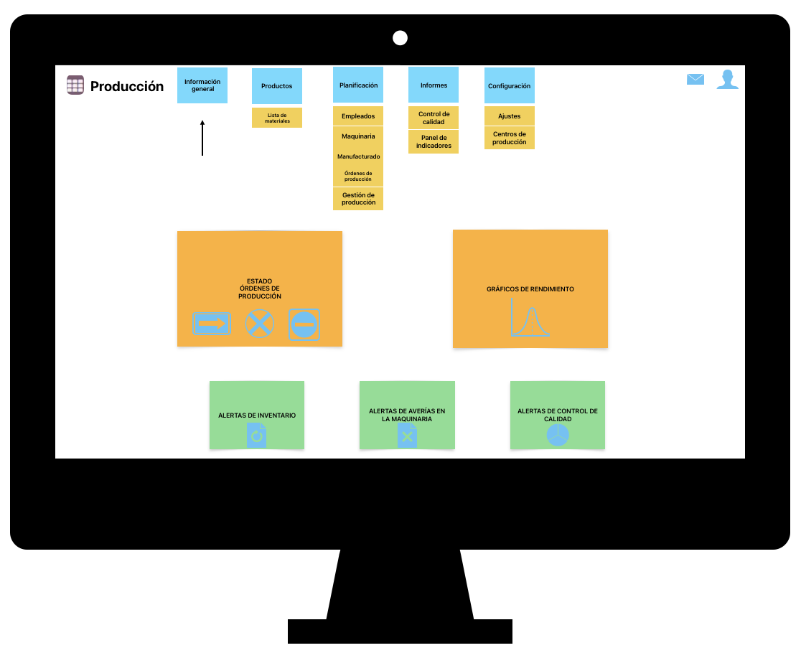
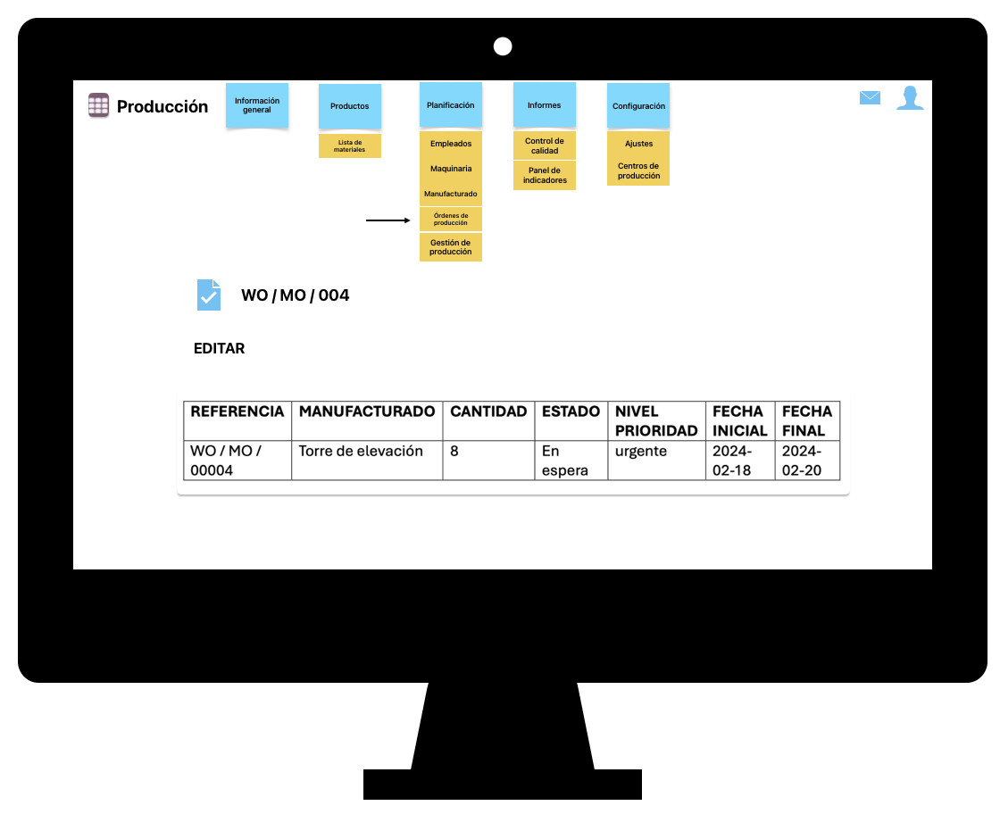
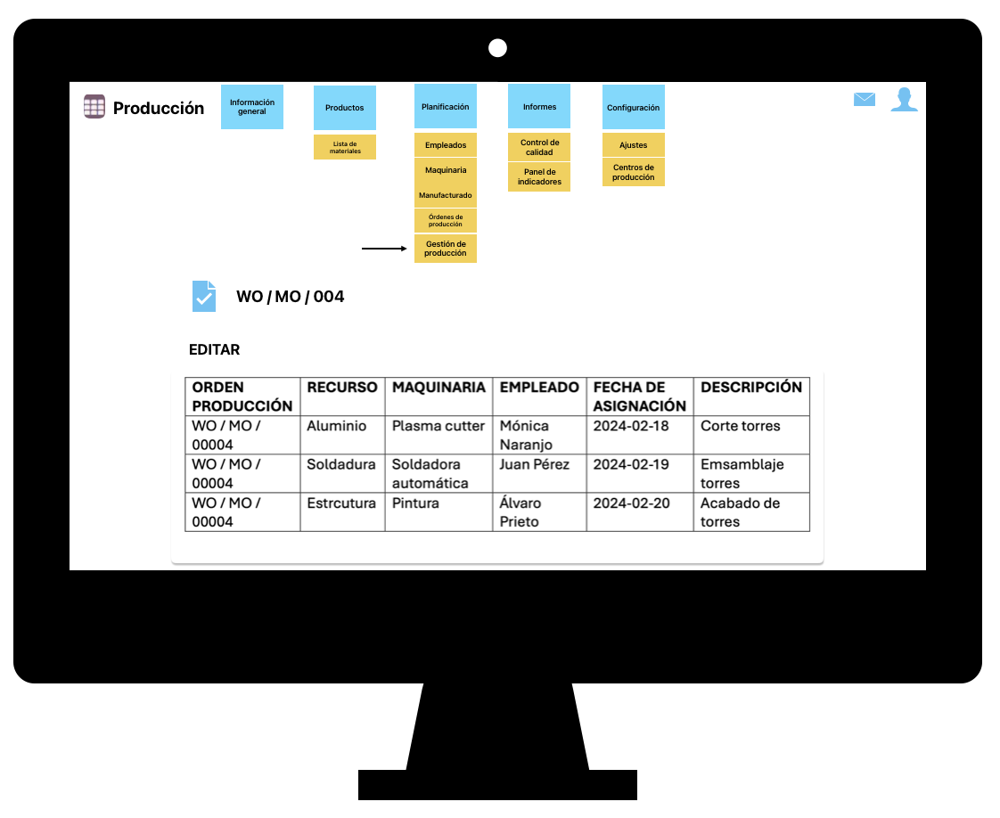

*Explicación general de las tablas*

Los pedidos generados en el departamento de ventas darán lugar automáticamente a órdenes de producción por manufactura. Estas órdenes de producción estarán organizadas en una tabla de gestión de la producción según las fases del proceso de fabricación, donde cada fase se asociará a los recursos, maquinaria y empleados necesarios para llevarla a cabo.

Una vez completadas todas las fases de producción, las diferentes máquinas enviarán una notificación para indicar que el proceso de manufactura ha finalizado. Si todos los productos del pedido han sido fabricados, se enviará una notificación tanto al departamento de producción como al de ventas.

*Wireframe página principal*

*Wireframe órdenes de producción*

*Wireframe gestión de la producción*

